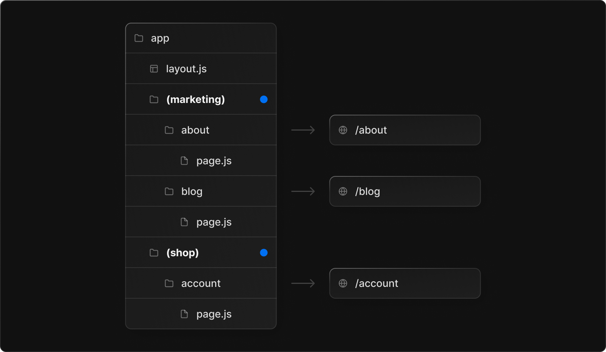
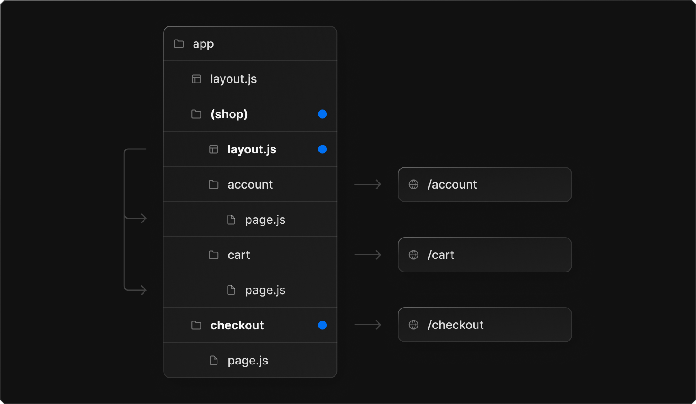
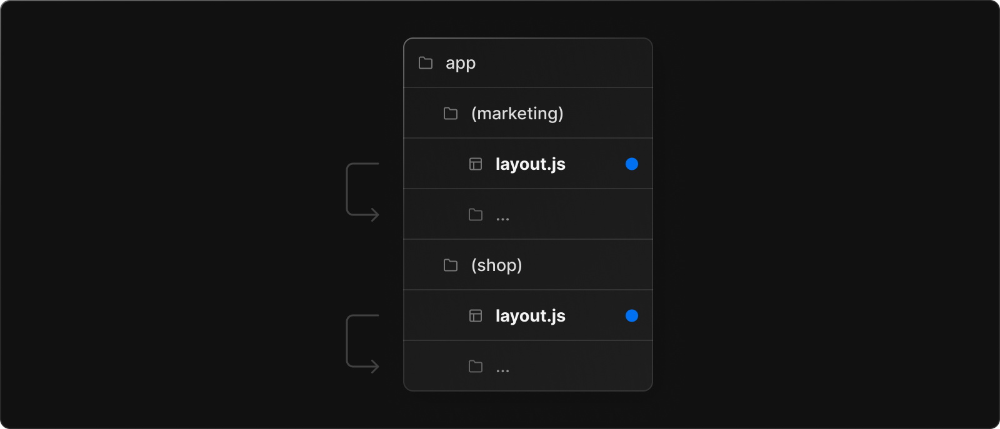

This is a [Next.js](https://nextjs.org/) project bootstrapped with [`create-next-app`](https://github.com/vercel/next.js/tree/canary/packages/create-next-app).

## Getting Started

First, run the development server:

```bash
npm run dev
# or
yarn dev
# or
pnpm dev
```

Open [http://localhost:3000](http://localhost:3000) with your browser to see the result.

You can start editing the page by modifying `app/page.tsx`. The page auto-updates as you edit the file.

[API routes](https://nextjs.org/docs/api-routes/introduction) can be accessed on [http://localhost:3000/api/hello](http://localhost:3000/api/hello). This endpoint can be edited in `pages/api/hello.ts`.

The `pages/api` directory is mapped to `/api/*`. Files in this directory are treated as [API routes](https://nextjs.org/docs/api-routes/introduction) instead of React pages.

This project uses [`next/font`](https://nextjs.org/docs/basic-features/font-optimization) to automatically optimize and load Inter, a custom Google Font.

## Learn More

To learn more about Next.js, take a look at the following resources:

- [Next.js Documentation](https://nextjs.org/docs) - learn about Next.js features and API.
- [Learn Next.js](https://nextjs.org/learn) - an interactive Next.js tutorial.

You can check out [the Next.js GitHub repository](https://github.com/vercel/next.js/) - your feedback and contributions are welcome!

## Deploy on Vercel

The easiest way to deploy your Next.js app is to use the [Vercel Platform](https://vercel.com/new?utm_medium=default-template&filter=next.js&utm_source=create-next-app&utm_campaign=create-next-app-readme) from the creators of Next.js.

Check out our [Next.js deployment documentation](https://nextjs.org/docs/deployment) for more details.

# nextjs 설정 정리

## app폴더 사용

- app폴더 안에서 폴더를 만들면 route규칙과 연결된다.
- 규칙에서 제외하고 싶다면 폴더 이름을 괄호로 묶어서 표현하자.
  

- 그룹으로 묶인 폴더 안에 페이지들은 공통 레이아웃을 사용할 수 있다.
  
- 공통 레이아웃을 사용하지 않으려면 부모의 layout을 제거하고 각 폴더에 layout을 추가하면 됨.
  

## 라우터 그룹 주의사항

- 그룹으로 묶은 후 동일한 패스를 사용하는 주소는 에러가 발생한다.
  > <mark>(marketing)/about/page.tsx</mark>, <mark>(shop)about/page.tsx</mark>
- 그룹 레이아웃에 사용은 전체 페이지 로드를 만들 수 있다.
  > 그룹별로 별도 layout을 사용한다면 페이지 이동 시 풀 페이지 re-rendering이 발생할 수 있다는 점~~

### 라우터 파마리터 이용

- 서버 컴포넌트는 동적인 정보를 가져 올 수 없고 client컴포넌트에서 사용가능한 훅을 접근 할 수 없음.
- 동적인 정보 현재 라우터 경로 정보등을 사용한다면 컴포넌트 상단에 client 컴포넌트를 나타내는 <mark>'use client'</mark>를 넣어줘야 한다.
- 동적 정보를 사용하는 페이지의 폴더는 <mark>[id]</mark> 처럼 id정보를 사용한다는 표시를 해준다.
- 여러 파라미터가 필요한 페이지의 경우 <mark>[...params]</mark>같은 나머지 기호를 폴더에 추가한다.
